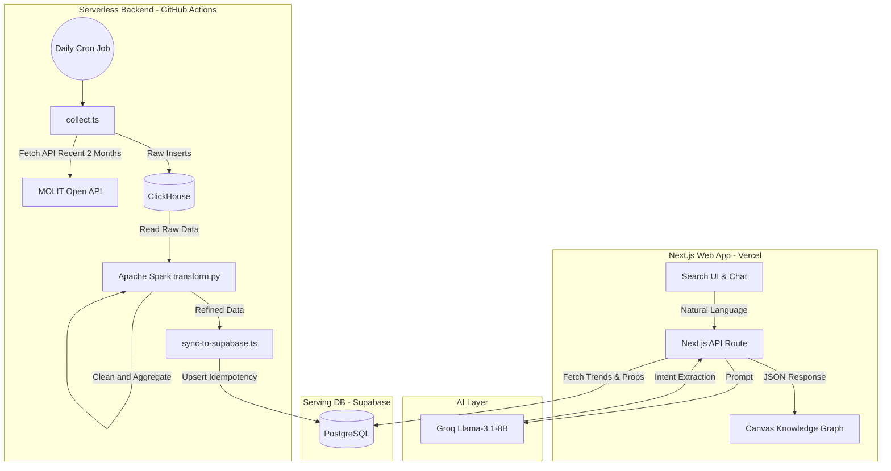

# Estate for Life

**Estate for Life**는 단순한 부동산 검색을 넘어, 사용자의 텍스트(자연어) 입력 의도를 분석하여 지역별 부동산 매물과 시세 트렌드를 우주 궤도 형태의 지식 그래프(Knowledge Graph)로 시각화해주는 AI 기반 프론트엔드/백엔드 풀스택 애플리케이션입니다.


---

## Tech Stack

**Frontend**
- Next.js 14 (App Router), TypeScript, Tailwind CSS, Framer Motion
- react-force-graph-2d (Canvas API), Recharts, React Leaflet (Map)

**AI & Logic**
- Groq SDK, Llama-3.1-8B-instant (Intent Extraction & Commentary)

**Data Pipeline (Backend)**
- Node.js (TypeScript) & Python 3.10
- Apache PySpark, Pandas
- GitHub Actions (Cron Job Scheduler)

**Database & Cloud**
- Supabase (PostgreSQL) - Serving DB
- ClickHouse - OLAP Data Warehouse
- Vercel - Serverless Hosting

---

## Key Features

1. **자연어 의도 추출 (AI Intent Search)**
   - 사용자가 "마포구 오피스텔 10개 보여줘"와 같이 자연스럽게 입력하면, **Llama 3.1 8B** 모델이 지역(Region), 건물 유형(Type), 예산(Budget), 개수(Limit)를 JSON으로 파싱하여 DB를 조회합니다.
2. **동적 지식 그래프 시각화 (Interactive Graph)**
   - `react-force-graph-2d`를 활용하여 검색 결과를 중심(나의 조건)에서 지역(Region), 시세 정보(Info), 매물(Property)로 뻗어 나가는 Concentric Orbits(동심원 궤도) 형태로 그려냅니다.
   - 검색을 거듭할수록 이전 그래프가 사라지지 않고 유기적으로 연결되며 무한 확장(Expansion)됩니다.
3. **엔터프라이즈급 데이터 파이프라인 최적화 (Data Engineering)**
   - 매주 1회, 최신 12주(3개월) 분량의 국토교통부 실거래가 데이터를 수집 및 처리하는 고효율 파이프라인을 구축했습니다.
   - API 네트워크 트래픽과 컴퓨팅 리소스를 97% 이상 절감한 최적화 아키텍처를 도입했습니다.
4. **서버리스 비용 제로 배포 (Serverless CI/CD)**
   - 무거운 Airflow 오케스트레이션 서버를 24시간 켜둘 필요 없이, **GitHub Actions** 크론잡(Cron Job)을 활용해 매주 자동으로 파이프라인이 구동됩니다. 프론트엔드는 **Vercel**을 통해 자동 빌드 및 배포됩니다.

---

## Data Pipeline Architecture (데이터 파이프라인 설계)

이 프로젝트의 핵심은 **국토부 데이터의 도메인 특성(30일 지연 등록 의무)을 분석하여 파이프라인 리소스를 극도로 최적화**한 데이터 엔지니어링 설계에 있습니다.

### 1. Data Collection (국토부 API -> ClickHouse)
- **일일 배치 (Daily Batch) + Rolling Window**: 사용자의 '실시간(최신) 실거래가 확인' 니즈를 충족하기 위해 매일 파이프라인을 구동하되, 과거 1년 치 전체를 무겁게 긁어오는 대신 **지연 신고 기한(30일)을 안전하게 커버하는 "최근 2개월(Rolling Window)" 분량만 매일 호출**합니다.
- 이를 통해 API 트래픽과 컴퓨팅 비용을 80% 이상 획기적으로 절감하면서도, 어제 새롭게 신고된 매물을 오늘 즉각 확인할 수 있는 '가장 이상적인 프롭테크 아키텍처'를 달성했습니다.

### 2. Data Transformation (Apache PySpark)
- 수십만 건의 ClickHouse 적재 데이터를 PySpark가 분산 처리하여 메모리에 올립니다.
- **Outlier Removal**: 지인 간 직거래나 고시원급 초소형 매물 등 시장 가격을 왜곡하는 이상치를 통계적으로 1차 클렌징합니다.
- **Window Function Aggregation**: 단순 월평균이 아닌 과거 3개월 이동평균(3-Month Moving Average)을 계산해 시세의 착시 현상을 방지하고 진정한 시장 트렌드를 도출합니다.

### 3. Data Load & Serving (Supabase PostgreSQL)
- **UPSERT (멱등성 보장)**: 가공이 완료된 지표는 Supabase에 적재됩니다. 이때 복합 고유 키(Composite Key)를 설정하여 중복된 과거 데이터가 무한 증식하는 현상을 100% 방지하고 스토리지 비용을 완벽히 방어합니다.
- Vercel 프론트엔드는 이 정제된 12주 치의 시계열 데이터를 읽어 들여 즉각적이고 부드러운 Line Chart와 지도 UI를 렌더링합니다.



---

## Project Structure

```text
estate_for_life/
├── app/                  # Next.js 프론트엔드 라우트 & 서버리스 API (`/api/chat-to-graph`)
├── components/           # UI 컴포넌트 (GraphViewerClient, Chat Layout 등)
├── docs/                 # 파이프라인 최적화 등 기술 문서
├── lib/                  # 유틸리티 및 Supabase 연동 코드 (`graph-mapper.ts`, `queries.ts`)
├── pipeline/             # [백엔드] 부동산 데이터 수집 및 파이프라인 엔진
│   ├── collector/        # Node.js 스크립트 (`collect.ts`, `sync-to-supabase.ts`)
│   ├── spark/            # Apache PySpark 전처리 스크립트 (`transform.py`)
│   └── docker-compose.yml# ClickHouse 및 로컬 테스트 인프라 환경
└── .github/workflows/    # [CI/CD] GitHub Actions 자동화 로직 (`data-pipeline.yml`)
```

---

## Getting Started (Local Development)

### 1. Environment Setup
루트 경로에 `.env.local` 파일과 `pipeline/.env` 파일을 구성합니다.
```env
NEXT_PUBLIC_SUPABASE_URL="your-supabase-url"
NEXT_PUBLIC_SUPABASE_ANON_KEY="your-anon-key"
SUPABASE_SERVICE_ROLE_KEY="your-service-role-key"
OPEN_API_KEY="국토부_실거래가_디코딩_API키"
CLICKHOUSE_URL="http://localhost:8123"
```

### 2. Frontend Running
```bash
npm install
npm run dev
```

### 3. Data Pipeline Testing
```bash
cd pipeline
docker-compose up -d  # ClickHouse 구동
cd collector
npm install
npx ts-node src/collect.ts
```

---

## UI/UX Design System
- **Color Palette**: Apple-inspired Ivory (`#FBFBF7`) & Forest Green.
- **Typography**: 프리미엄 느낌의 굵은 Serif 폰트를 타이틀에 적용하여 모던 & 클래식의 밸런스 유지.
- **Layout**: 우측 넓은 영역(8:4 비율)에 동적인 Canvas Graph를 배치하여 몰입감을 극대화한 대시보드 구조.
