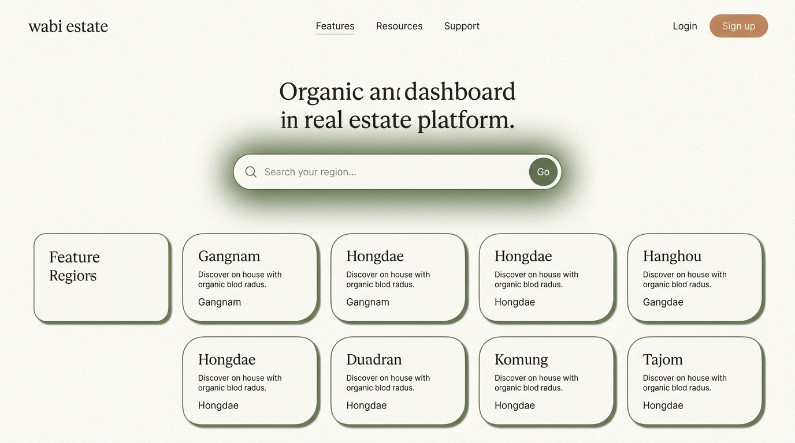

# Wabi Estate (자취방 전월세 시세 대시보드)


> ※GPT 이미지 생성 모델을 통해 제작되었습니다.

서울·경기 대학가와 업무지구의 오피스텔·연립다세대·단독다가구 전월세 실거래가 추이를 보여주는 풀스택 대시보드입니다. 로컬 데이터 파이프라인(Airflow)이 실거래 데이터를 수집·정제·집계해 Supabase(Postgres)로 자동 동기화하고, Vercel에 배포된 Next.js 프론트엔드가 이를 서빙하는 하이브리드 아키텍처를 가집니다.

## 목표

사회초년생·대학생에게 **오피스텔·연립다세대·단독다가구 전월세** 정보는 파편화되어 있습니다. 이 프로젝트는 대학가·업무지구로 지역을 좁혀, "이 동네 원룸 시세가 최근 어떻게 변했는지"를 직관적으로 비교 분석할 수 있는 대시보드를 목표로 합니다.

## 수집 데이터 및 지역

| 항목 | 내용 |
|---|---|
| 원천 데이터 | 국토교통부 실거래가 공개시스템 Open API |
| 대상 매물 유형 | 오피스텔, 연립다세대, 단독·다가구 전월세 |
| 대상 지역 (14곳) | **서울 Tier 1**: 관악, 성북, 서대문, 광진, 동대문, 마포 <br> **서울 Tier 2**: 강남, 서초, 영등포, 송파 <br> **경기**: 수원, 용인, 성남, 안양 |

## 아키텍처

```
[국토부 실거래가 API] ──▶ 로컬 Docker Compose
                              ├─ Airflow (주 단위 자동 실행, 동적 Lookback 보정)
                              ├─ Collector (ClickHouse 적재 및 집계)
                                      │
                                      ▼
                          Supabase(Postgres) 클라우드로 집계 결과 동기화
                                      │
                          Vercel On-Demand Revalidate (캐시 무효화 웹훅)
                                      ▼
                      Next.js 프론트엔드 (Supabase 단일 진입점 조회)
```

이 프로젝트는 **Self-Healing** 로직을 포함합니다. 컴퓨터가 꺼져 파이프라인 스케줄을 며칠 건너뛰더라도, 다음 기동 시 마지막 성공 로그를 분석해 누락된 기간만큼 동적으로 범위를 계산(Lookback)하여 데이터의 이빨 빠짐 현상을 스스로 복구합니다.

## 사용 스택

- **백엔드 파이프라인**: Node.js/TypeScript (수집기), ClickHouse (분석 DB), Apache Airflow (오케스트레이션), Docker Compose
- **서빙 저장소**: Supabase (Postgres)
- **프론트엔드**: Next.js (App Router), TypeScript, Recharts (시각화), Vercel (배포)

## 폴더 구조
```
/pipeline       # 로컬 전용 DE 파이프라인 (Docker Compose, Airflow, Collector)
/app            # Next.js 프론트엔드 라우트 (App Router)
/components     # 프론트엔드 UI 컴포넌트
/lib            # 프론트엔드 데이터 단일 진입점 (queries.ts 등)
```

## 실행 가이드라인

### 1. 프론트엔드 (로컬 개발)
프론트엔드는 프로젝트 최상단 루트 폴더에서 구동됩니다.
```bash
# 1. 패키지 설치
npm install

# 2. 환경변수 세팅
cp .env.example .env.local
# .env.local 파일에 NEXT_PUBLIC_SUPABASE_URL, NEXT_PUBLIC_SUPABASE_ANON_KEY 등 기입

# 3. 개발 서버 실행
npm run dev
# http://localhost:3000 접속
```
*(주의: 화면에 데이터가 표시되려면 Supabase에 최소 1회 파이프라인을 통한 시딩이 완료되어 있어야 합니다.)*

### 2. 백엔드 데이터 파이프라인 (로컬 Docker)
파이프라인 실행은 반드시 `pipeline` 폴더로 진입하여 수행합니다.
```bash
# 1. 파이프라인 폴더 진입
cd pipeline

# 2. 파이프라인 환경변수 세팅
cp .env.example .env
# .env 파일에 공공데이터 OPEN_API_KEY, SUPABASE_SERVICE_ROLE_KEY 등 기입

# 3. Docker Compose 기동
docker compose up -d

# 4. (최초 1회 한정) 지역 코드 시딩
npm run seed:regions
```
이후 Airflow 웹 UI(`http://localhost:8080`)에 접속해 `rent_collection_pipeline` DAG를 켜주면 수집 및 동기화 사이클이 동작합니다.

## 배포
- 저장소를 **Vercel**에 연결하면 UI 코드 변경 시 자동 배포됩니다.
- UI 배포와 무관하게, 로컬 파이프라인이 데이터를 수집할 때마다 Vercel의 `/api/revalidate` 엔드포인트를 찔러 정적 캐시(SSG)를 깔끔하게 실시간 갱신합니다.

## 데이터 출처 및 라이선스
- 국토교통부 실거래가 공개시스템, 행정표준코드관리시스템 (공공데이터포털)
- 이 프로젝트는 개인 학습·포트폴리오 목적으로 제작되었으며, 시세 정보는 참고용으로만 활용하시기 바랍니다.
